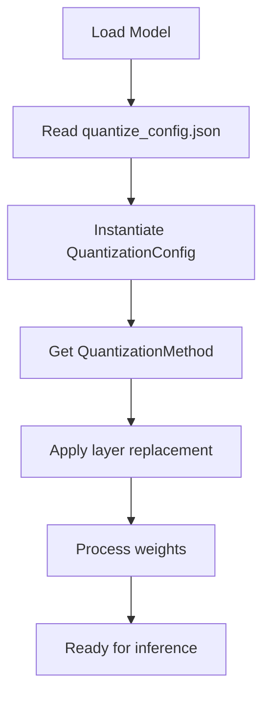

# Understanding Quantization in vLLM

This section explains how quantization is implemented in vLLM, focusing on the architecture of weight-only post-training quantization (PTQ). We analyze how methods like GPTQ and AWQ are supported, and how QTIP can leverage the same modularity to integrate efficiently.

## 1. Quantization Architecture in vLLM

vLLM adopts a plugin-style quantization system. Each quantization method is defined by:

- A configuration class (`QuantizationConfig`)
- A method class (`QuantizeMethodBase`) 
- A custom layer implementation (e.g. `QuantizedLinear`)

This system is built to allow different quantization schemes to be swapped in and configured without changing model code.

### 1.1 Configuration Entry Point: quantize_config.json

Users specify their quantization settings via a JSON config file. Example for GPTQ:

```json
{
  "quant_method": "gptq",
  "bits": 4,
  "group_size": 128,
  "desc_act": false,
  "sym": true
}
```

This config is loaded and passed to the appropriate `QuantizationConfig` subclass through `get_quantization_config()` in `model_loader/weight_utils.py`.

### 1.2 QuantizationConfig and Method Class

Every method implements two key components:

| Component | Description |
|-----------|-------------|
| QuantizationConfig | Parses config file and holds parameters |
| QuantizeMethodBase | Applies layer substitution and post-load processing |

GPTQ Example:

- `GPTQConfig` parses: bits, group_size, sym, etc.
- `GPTQLinearMethod` does: 
  - Replaces nn.Linear with GPTQLinear
  - Loads quantized weights from disk or memory
  - Registers kernel-based gptq_gemm for inference

## 2. Layer Replacement Flow

Step-by-Step Flow:

1. `model_loader.py` reads the `quantize_config.json`
2. It instantiates a `QuantizationConfig` based on `quant_method`
3. Calls `.get_quant_method()` to return a `QuantizeMethodBase` object
4. The `apply()` method replaces `torch.nn.Linear` with custom logic
5. The `process_weights_after_loading()` method quantizes or prepares the weights

This structure enables QTIP to seamlessly fit into the same flow.



## 3. Custom Layer Logic

For GPTQ:
The core linear layer becomes `GPTQLinear`, which:
- Stores compressed weight groups
- Applies scaling/zero-point corrections
- Uses `gptq_gemm()` CUDA kernel during forward pass

For QTIP, this would become:
`QuantizedLinear` (a wrapper around BitshiftLinear)
- Supports decode modes (lut, 1mad, 3inst)
- Can use:
  - CUDA kernel path (e.g., bitshift_linear_kernel)
  - Python fallback path (e.g., decode_compressed + torch.matmul)

## 4. Where to Hook QTIP

| Location | Purpose | QTIP Integration Point |
|----------|---------|------------------------|
| model_loader.py | Loads config | Register "qtip" as quant method |
| quantization/quant_config.py | Config parsing | Add QTIPConfig |
| quantization/method.py | Method interface | Add QTIPLinearMethod |
| layers/quantized_linear.py | Layer definition | Add QuantizedLinear class |
| custom_ops/bitshift_linear.cpp | CUDA kernel (optional) | Register bitshift kernel (optional) |

This design keeps all QTIP logic localized and modular.

## 5. Implementation Example

Here's a simplified code example showing how the QTIP integration might look:

```python
# In quantization/quant_config.py
class QTIPConfig(QuantizationConfig):
    def __init__(self, L: int, K: int, V: int, tlut_bits: int = 16,
                 decode_mode: str = "1mad", quantlut_path: Optional[str] = None):
        super().__init__()
        self.L = L  # Number of codebooks
        self.K = K  # Number of centroids per codebook
        self.V = V  # Number of vectors per centroid
        self.tlut_bits = tlut_bits  # Bits for lookup table
        self.decode_mode = decode_mode  # Decoding mode
        self.quantlut_path = quantlut_path  # Path to quantization lookup table

    def get_quant_method(self, layer: torch.nn.Module,
                        prefix: str) -> Optional["QTIPLinearMethod"]:
        if isinstance(layer, LinearBase):
            return QTIPLinearMethod(self)
        return None

# In quantization/method.py
class QTIPLinearMethod(QuantizeMethodBase):
    def __init__(self, config: QTIPConfig):
        self.config = config
        
    def create_weights(self, layer: torch.nn.Module,
                      input_size_per_partition: int,
                      output_partition_sizes: list[int],
                      input_size: int,
                      output_size: int,
                      params_dtype: torch.dtype,
                      **extra_weight_attrs):
        # Create compressed weight storage
        weight = torch.nn.Parameter(
            torch.empty(sum(output_partition_sizes),
                       input_size_per_partition,
                       dtype=params_dtype),
            requires_grad=False)
            
        # Initialize codebook
        cb = BitshiftCodebook(self.config)
        cb.quantize(weight)
        layer.qtip_cb = cb
        
        set_weight_attrs(weight, {"input_dim": 1, "output_dim": 0})
        layer.register_parameter("weight", weight)
        set_weight_attrs(weight, extra_weight_attrs)
        
    def apply(self, layer: torch.nn.Module,
              x: torch.Tensor,
              bias: Optional[torch.Tensor] = None) -> torch.Tensor:
        # Decode weights if not cached
        if not hasattr(layer, "decoded_weight"):
            layer.decoded_weight = layer.qtip_cb.recons()
            
        # Perform matrix multiplication
        out = torch.matmul(x, layer.decoded_weight.t())
        if bias is not None:
            out += bias
        return out
```

## 6. Extending for Dynamic Decode Mode Selection

One advantage of QTIP is the ability to switch decode modes at runtime. This can be implemented by:

1. Adding a runtime flag to the vLLM server:
```bash
python -m vllm.entrypoints.api_server --decode-mode=1mad
```

2. Updating the QuantizedLinear implementation to support mode switching:
```python
class QuantizedLinear(nn.Module):
    def forward(self, x):
        # Check current decode mode
        mode = get_current_decode_mode()
        if mode == "lut":
            return self._forward_lut(x)
        elif mode == "1mad":
            return self._forward_1mad(x)
        # ...
```

This allows users to experiment with different decode modes without reloading the model.

## 7. Performance Considerations

When implementing QTIP in vLLM, several performance considerations should be kept in mind:

1. Memory Locality: Keep the LUT tables (if used) in shared memory or L1 cache
2. Kernel Fusion: Where possible, fuse the decode and matmul operations
3. Parallelism: Ensure the decode methods are highly parallelizable for GPU execution
4. KV Cache Interaction: Consider how quantization affects KV cache management

By carefully integrating with vLLM's existing architecture, QTIP can deliver its compression benefits while maintaining the performance advantages of vLLM's paged attention system.