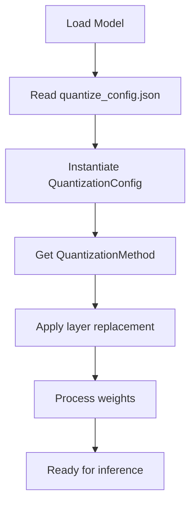

# Understanding Quantization in vLLM

This section explains how quantization is implemented in vLLM, focusing on the architecture of weight-only post-training quantization (PTQ). We analyze how methods like GPTQ and AWQ are supported, and how QTIP can leverage the same modularity to integrate efficiently.

## 1. Quantization Architecture in vLLM

vLLM adopts a plugin-style quantization system. Each quantization method is defined by:

- A configuration class (`QuantizationConfig`)
- A method class (`QuantizeMethodBase`) 
- A custom layer implementation (e.g. `QuantizedLinear`)

This system is built to allow different quantization schemes to be swapped in and configured without changing model code.

### 1.1 Configuration Entry Point: quantize_config.json

Users specify their quantization settings via a JSON config file. Example for GPTQ:

```json
{
  "quant_method": "gptq",
  "bits": 4,
  "group_size": 128,
  "desc_act": false,
  "sym": true
}
```

This config is loaded and passed to the appropriate `QuantizationConfig` subclass through `get_quantization_config()` in `model_loader/weight_utils.py`.

### 1.2 QuantizationConfig and Method Class

Every method implements two key components:

| Component | Description |
|-----------|-------------|
| QuantizationConfig | Parses config file and holds parameters |
| QuantizeMethodBase | Applies layer substitution and post-load processing |

GPTQ Example:

- `GPTQConfig` parses: bits, group_size, sym, etc.
- `GPTQLinearMethod` does: 
  - Replaces nn.Linear with GPTQLinear
  - Loads quantized weights from disk or memory
  - Registers kernel-based gptq_gemm for inference

## 2. Layer Replacement Flow

Step-by-Step Flow:

1. `model_loader.py` reads the `quantize_config.json`
2. It instantiates a `QuantizationConfig` based on `quant_method`
3. Calls `.get_quant_method()` to return a `QuantizeMethodBase` object
4. The `apply()` method replaces `torch.nn.Linear` with custom logic
5. The `process_weights_after_loading()` method quantizes or prepares the weights

This structure enables QTIP to seamlessly fit into the same flow.



## 3. Custom Layer Logic

For GPTQ:
The core linear layer becomes `GPTQLinear`, which:
- Stores compressed weight groups
- Applies scaling/zero-point corrections
- Uses `gptq_gemm()` CUDA kernel during forward pass

For QTIP, this would become:
`BitshiftLinear` (implemented in qtip.py)
- Supports decode modes (lut, 1mad, 3inst)
- Can use:
  - Custom decode methods (implemented in custom_ops/)
  - Codebook class for codebook operations
  - Python fallback path (e.g., decode_compressed + torch.matmul)

## 4. Where to Hook QTIP

| Location | Purpose | QTIP Integration Point |
|----------|---------|------------------------|
| __init__.py | Load config | Register "qtip" as quant method |
| qtip.py | Config parsing and layer definition | Add QTIPConfig and BitshiftLinear class |
| custom_ops/ | Decode methods and codebook | Implement decode methods and Codebook class |

This design keeps all QTIP logic localized and modular.

