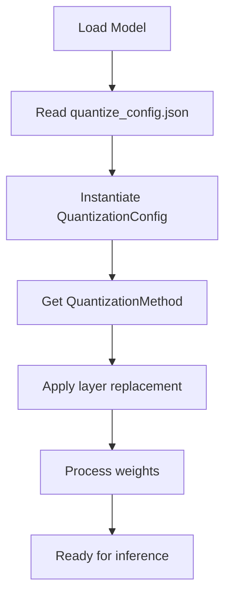

# Understanding Quantization in vLLM

This section explains how quantization is implemented in vLLM, focusing on the architecture of weight-only post-training quantization (PTQ). We analyze how methods like GPTQ and AWQ are supported, and how QTIP can leverage the same modularity to integrate efficiently.

---

## 1. Quantization Architecture in vLLM

vLLM adopts a **plugin-style quantization system**. Each quantization method is defined by:

- A configuration class (`QuantizationConfig`)
- A method class (`QuantizationMethod`)
- A custom layer implementation (`QuantizedLinear`, etc.)

This system is built to allow different quantization schemes to be swapped in and configured without changing model code.

### 1.1 Configuration Entry Point: `quantize_config.json`

Users specify their quantization settings via a JSON config file. Example for GPTQ:

```json
{
  "quant_method": "gptq",
  "bits": 4,
  "group_size": 128,
  "desc_act": false,
  "sym": true
}
```

This config is loaded and passed to the appropriate `QuantizationConfig` subclass.

### 1.2 QuantizationConfig and Method Class

Every method implements two key components:

| Component | Description |
|-----------|-------------|
| `QuantizationConfig` | Parses config file and holds parameters |
| `QuantizationMethod` | Applies layer substitution and post-load processing |

**GPTQ Example**

`GPTQConfig` parses:
- bits, group_size, sym, etc.

`GPTQLinearMethod` does:
- Replaces `nn.Linear` with `GPTQLinear`
- Loads quantized weights from disk or memory
- Registers kernel-based `gptq_gemm` for inference

## 2. Layer Replacement Flow

### Step-by-Step Flow

1. `model_loader.py` reads the `quantize_config.json`
2. It instantiates a `QuantizationConfig` based on `quant_method`
3. Calls `.get_method()` to return a `QuantizationMethod` object
4. The `apply()` method replaces `torch.nn.Linear` with custom logic
5. The `process_weights_after_loading()` method quantizes or prepares the weights

This structure enables QTIP to seamlessly fit into the same flow.



## 3. Custom Layer Logic

### For GPTQ:

The core linear layer becomes `GPTQLinear`, which:
- Stores compressed weight groups
- Applies scaling/zero-point corrections
- Uses `gptq_gemm()` CUDA kernel during forward pass

### For QTIP, this would become:

`QuantizedLinear` (a wrapper around `BitshiftLinear`)
- Supports decode modes (lut, 1mad, 3inst)
- Can use:
  - CUDA kernel path (e.g., `bitshift_linear_kernel`)
  - Python fallback path (e.g., `decode_compressed + torch.matmul`)

## 4. Where to Hook QTIP

| Location | Purpose | QTIP Integration Point |
|----------|---------|------------------------|
| `model_loader.py` | Loads config | Register "qtip" as quant method |
| `quantization/quant_config.py` | Config parsing | Add `QTIPConfig` |
| `quantization/method.py` | Method interface | Add `QTIPLinearMethod` |
| `layers/quantized_linear.py` | Layer definition | Add `QuantizedLinear` class |
| `custom_ops/bitshift_linear.cpp` | CUDA kernel (optional) | Register bitshift kernel (optional) |

This design keeps all QTIP logic localized and modular.

## 5. Implementation Example

Here's a simplified code example showing how the QTIP integration might look:

```python
# In quantization/quant_config.py
class QTIPConfig(QuantizationConfig):
    def __init__(self, bits=4, group_size=128, decode_mode="lut"):
        self.bits = bits
        self.group_size = group_size
        self.decode_mode = decode_mode
        
    def get_method(self):
        return QTIPLinearMethod(self)


# In quantization/method.py
class QTIPLinearMethod(QuantizationMethod):
    def apply(self, model):
        for name, module in model.named_modules():
            if isinstance(module, nn.Linear):
                # Replace with QTIP version
                qtip_layer = QuantizedLinear(
                    module.in_features,
                    module.out_features,
                    self.config.bits,
                    self.config.group_size,
                    self.config.decode_mode
                )
                # ... set up replacement ...
                
    def process_weights_after_loading(self, model):
        # Apply incoherence processing if needed
        # Set up bitshift trellis and compressed weights
```

## 6. Extending for Dynamic Decode Mode Selection

One advantage of QTIP is the ability to switch decode modes at runtime. This can be implemented by:

1. Adding a runtime flag to the vLLM server:
   ```bash
   python -m vllm.entrypoints.api_server --decode-mode=1mad
   ```

2. Updating the `QuantizedLinear` implementation to support mode switching:
   ```python
   class QuantizedLinear(nn.Module):
       def forward(self, x):
           # Check current decode mode
           mode = get_current_decode_mode()
           if mode == "lut":
               return self._forward_lut(x)
           elif mode == "1mad":
               return self._forward_1mad(x)
           # ...
   ```

This allows users to experiment with different decode modes without reloading the model.

## 7. Performance Considerations

When implementing QTIP in vLLM, several performance considerations should be kept in mind:

- **Memory Locality**: Keep the LUT tables (if used) in shared memory or L1 cache
- **Kernel Fusion**: Where possible, fuse the decode and matmul operations
- **Parallelism**: Ensure the decode methods are highly parallelizable for GPU execution
- **KV Cache Interaction**: Consider how quantization affects KV cache management

By carefully integrating with vLLM's existing architecture, QTIP can deliver its compression benefits while maintaining the performance advantages of vLLM's paged attention system.